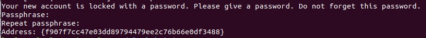
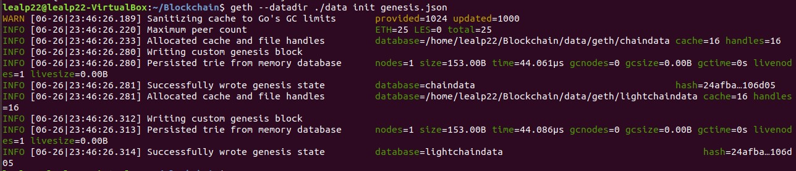
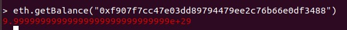
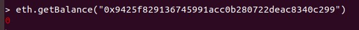
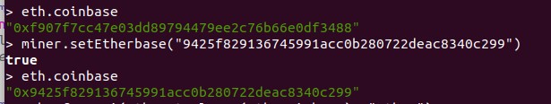
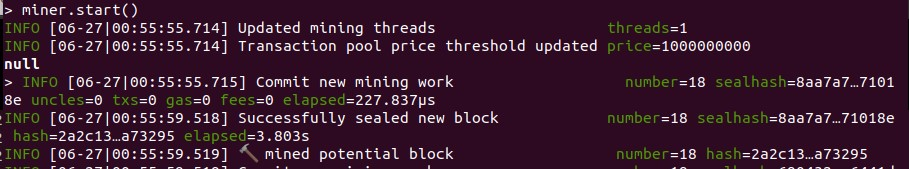
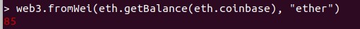

# Ejercicio 1 (2 puntos)
---
Construya y configure su propia blockchain a partir de un archivo génesis que usted mismo debe definir. Se recomienda el uso del cliente Geth.
 - Cree una cuenta mediante el cliente Geth.
 - Consiga su propio Ether a partir de la minería.
Si realiza instrucciones adicionales dentro del cliente, se valorará positivamente.

_Entrega_: Debe desarrollar un archivo .md donde describa el procedimiento realizado para resolver el ejercicio. Además en el mismo repositorio debe alojar el archivo génesis y los pantallazos que considere necesarios. Haga referencia a éstos a partir del archivo .md.

---

**1º)** Creamos la carpeta de trabajo _./data_ 

**2º)** Con Geth creamos una cuenta personal que incluiremos en el archivo génesis (Parámetro _alloc_). Para ello utilizaremos el comando:

> _$ geth account new --datadir ./data_  

Esto sacará por pantalla algo como:
```
Your new account is locked with a password. Please give a password. Do not forget this password.
Passphrase:
Repeat passphrase:
Address: {f907f7cc47e03dd89794479ee2c76b66e0df3488}
```
\<Ver imagen Screenshot_1.jpg>  


Con este paso se ha creado la cuenta:  
>_**0xf907f7cc47e03dd89794479ee2c76b66e0df3488**_

Con el mismo comando creamos también otra cuenta que utilizaremos para el minado:
>_**0x9425f829136745991acc0b280722deac8340c299**_


**3º)** Creamos el fichero genesis.json en la carpeta de trabajo donde vamos a almacenar la blockchain con el siguiente contenido:
```
{  
    "config": {  
        "chainId": 1500,  
        "homesteadBlock": 0,  
        "eip155Block": 0,  
        "eip158Block": 0  
    },  
    "difficulty": "1024",  
    "gasLimit": "200000",  
    "alloc": {  
        "f907f7cc47e03dd89794479ee2c76b66e0df3488": { "balance": "999999999999999999999999999999" }
    }  
}  
```
Incluimos la cuenta creada en el paso anterior de forma que podamos disponer de saldo para operar desde el momento en que se cree la blockchain.

Para entender mejor el significado de cada uno de los parámetros se puede consultar la web:
https://arvanaghi.com/blog/explaining-the-genesis-block-in-ethereum/

**4º)** Creamos la blockchain con el siguiente comando:

> _$ geth --datadir ./data init genesis.json_  

Obteniendo la salida:
```
WARN [06-26|23:46:26.189] Sanitizing cache to Go's GC limits       provided=1024 updated=1000
INFO [06-26|23:46:26.220] Maximum peer count                       ETH=25 LES=0 total=25
INFO [06-26|23:46:26.233] Allocated cache and file handles         database=/home/lealp22/Blockchain/data/geth/chaindata cache=16 handles=16
INFO [06-26|23:46:26.280] Writing custom genesis block 
INFO [06-26|23:46:26.280] Persisted trie from memory database      nodes=1 size=153.00B time=44.061µs gcnodes=0 gcsize=0.00B gctime=0s livenodes=1 livesize=0.00B
INFO [06-26|23:46:26.281] Successfully wrote genesis state         database=chaindata                                    hash=24afba…106d05
INFO [06-26|23:46:26.281] Allocated cache and file handles         database=/home/lealp22/Blockchain/data/geth/lightchaindata cache=16 handles=16
INFO [06-26|23:46:26.312] Writing custom genesis block 
INFO [06-26|23:46:26.313] Persisted trie from memory database      nodes=1 size=153.00B time=44.086µs gcnodes=0 gcsize=0.00B gctime=0s livenodes=1 livesize=0.00B
INFO [06-26|23:46:26.314] Successfully wrote genesis state         database=lightchaindata                                    hash=24afba…106d05
```
\<Ver imagen Screenshot_2.jpg>  


**5º)** Consultamos el saldo de la cuenta en _genesis.json_ para confirmar que se ha incluido correctamente:

Ejecutamos la consola:
> _$ geth console --datadir ./data --networkid 1500_  

Consultamos el saldo:
> \> _eth.getBalance("0xf907f7cc47e03dd89794479ee2c76b66e0df3488")_  

\<Ver imagen Screenshot_4.jpg>  


**6º)** Consultamos el saldo de la cuenta creada para la minería (_0x9425f829136745991acc0b280722deac8340c299_) y confirmamos que su saldo es cero:

\<Ver imagen Screenshot_5.jpg>  


 
**7º)** Comprobamos la coinbase y configuramos la cuenta que hemos creado para ello:

> \> _eth.coinbase_  
> \> _miner.setEtherbase("9425f829136745991acc0b280722deac8340c299")_  
> \> _eth.coinbase_

\<Ver imagen Screenshot_7.jpg>  


**8º)** Conseguir Ethers a través de la mineria: 

- Iniciamos el minado con el comando:
> \> _miner.start()_
- Esperamos hasta minar algunos bloques:  

> \<Ver imagen Screenshot_8.jpg>  
  
- Detenemos el minado con el comando:
> \> _miner.stop()_
- Consultamos el saldo de la cuenta coinbase para comprobar que se está minando correctamente:
> \> _web3.fromWei(eth.getBalance(eth.coinbase), "ether")_

> Vemos que, efectivamente, tenemos 85 Ethers:  

> \<Ver imagen Screenshot_9.jpg>  



