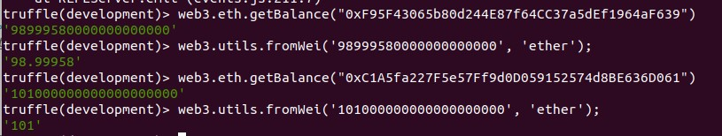

# Ejercicio 2 (2 puntos)

---
1. A partir del ejercicio anterior, cree una nueva cuenta en su blockchain. Realice mediante el propio cliente Geth una transferencia de 1 Ether entre dos cuentas de esta blockchain.
2. Realice mediante la consola de Truffle y conectado a una blockchain desplegada con Ganache una transferencia de 1 Ether entre dos cuentas de esta blockchain. Puede aprovechar el entorno creado en la actividad primera del bloque 1 ( Truffle Pet Shop ).

_Entrega_: Debe desarrollar un archivo .md donde describa el procedimiento realizado para resolver el ejercicio y los balances de las cuentas. Además en el mismo repositorio debe alojar los pantallazos que considere necesarios. Haga referencia a éstos a partir del
archivo .md.

---

**1º)** Desde la consola de Geth:

Ejecutamos la consola:
> _$ geth console --datadir ./data --networkid 1500_  

Creamos una nueva cuenta:  
> _\> personal.newAccount()_

> \<Ver imagen Screenshot_1.jpg>  


La cuenta creada es:  
>_**0xcffa7953de7312c37d5fbfcbfae57640ac5cad1d**_

Antes de poder hacer una transferencia desde algunas de las cuentas creadas anteriormente, necesitamos desbloquearla:  
> _\> personal.unlockAccount("0xf907f7cc47e03dd89794479ee2c76b66e0df3488")_

> \<Ver imagen Screenshot_2.jpg>  


Realizamos la transferencia de 1 Ether con el siguiente comando:  
```
     eth.sendTransaction(
       {
         from:"0xf907f7cc47e03dd89794479ee2c76b66e0df3488",
         to:"0xcffa7953de7312c37d5fbfcbfae57640ac5cad1d",
         value: web3.toWei(1, "ether")
       }
     )
```
> \<Ver imagen Screenshot_3.jpg>  


El hash de la transacción es:
_0x1f6b1aec29299efc760989cc15581e425272ec1a3a0bb2325d411c6bd1b13f30_

Si revisamos el saldo de la cuenta destino vemos que sigue siendo cero:

> _\>web3.fromWei(eth.getBalance("0xcffa7953de7312c37d5fbfcbfae57640ac5cad1d"), "ether")_

> \<Ver imagen Screenshot_4.jpg>  


El que no esté el Ether se debe a que la transferencia está sin confirmar pues aún no se ha minado. 
- Empezamos, por tanto, con el minado:
> \> _miner.start()_
- Esperamos hasta minar algún bloque:  

> \<Ver imagen Screenshot_5.jpg>  
  
- Detenemos el minado con el comando:
> \> _miner.stop()_
- Volvemos a comprobar el saldo de la cuenta para comprobar se ha actualizado el saldo correctamente:
> \> _web3.fromWei(eth.getBalance("0xcffa7953de7312c37d5fbfcbfae57640ac5cad1d"), "ether")_

> Vemos que, efectivamente, tenemos 1 Ether:  

> \<Ver imagen Screenshot_6.jpg>  


> Por si quedase alguna duda, podemos consultar el recibo de la transacción para comprobar que se ha realizado correctamente:

> _\> _web3.eth.getTransactionReceipt("0x1f6b1aec29299efc760989cc15581e425272ec1a3a0bb2325d411c6bd1b13f30")_

> \<Ver imagen Screenshot_7.jpg>  


---


**2º)** Desde la consola de Truffle:

- Ejecutamos Ganache:

> \<Ver imagen Screenshot_10.jpg>  


- Ejecutamos la consola de Truffle y vemos qué cuentas tenemos disponibles (y que concuerdan con las de Ganache):

> _\> _web3.eth.getAccounts()_

> \<Ver imagen Screenshot_11.jpg>  


- Consultamos sus saldos:

> \<Ver imagen Screenshot_12.jpg>  


- Y ejecutamos la transacción:
```
     web3.eth.sendTransaction({
	       from:"0xF95F43065b80d244E87f64CC37a5dEf1964aF639", 
	       to:"0xC1A5fa227F5e57Ff9d0D059152574d8BE636D061", 
	       value: 1000000000000000000
     })
```
> \<Ver imagen Screenshot_13.jpg>  


- Consultamos los saldos de ambas cuentas y vemos que estos ya se han actualizado (Ganache mina de forma automática):

> - 0xF95F43065b80d244E87f64CC37a5dEf1964aF639 --> 98.99958 Eth
> - 0xC1A5fa227F5e57Ff9d0D059152574d8BE636D061 --> 101 Eth

> \<Ver imagen Screenshot_14.jpg>  


- Lo cual coincide con los saldos mostrados en Ganache:

> \<Ver imagen Screenshot_15.jpg>  


> \<Ver imagen Screenshot_16.jpg>  
