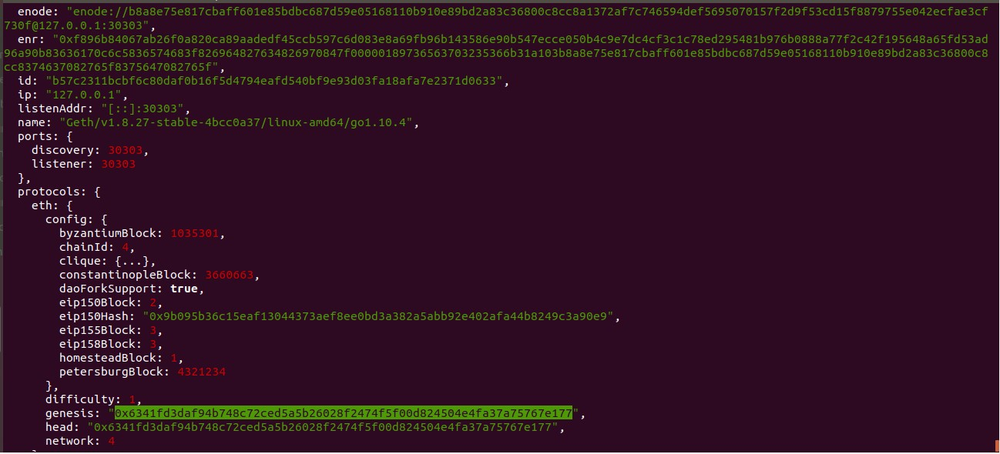
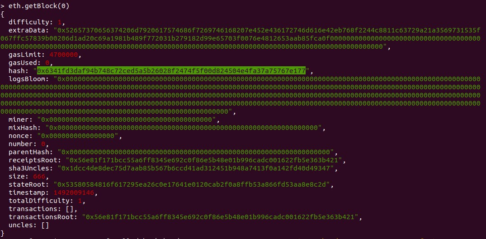
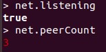
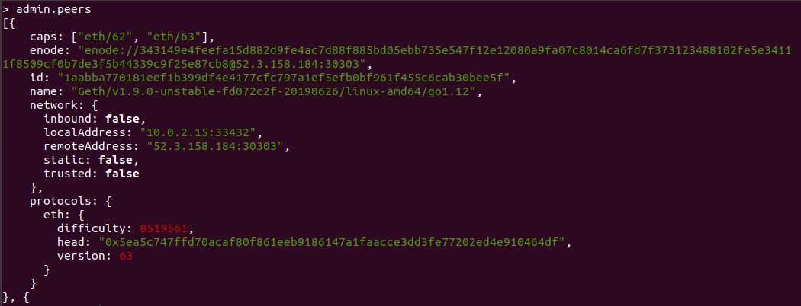
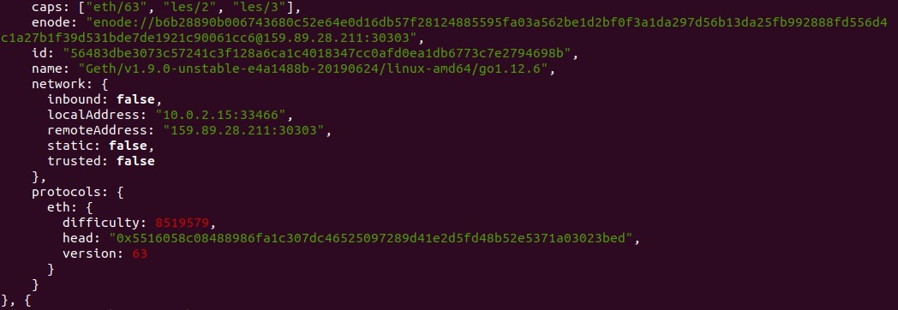
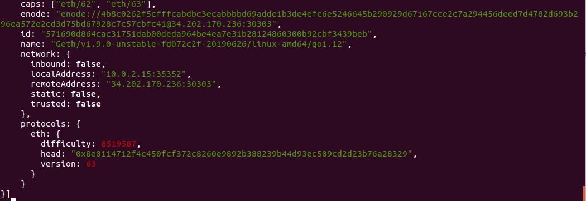
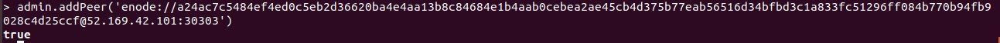

#Ejercicio 3 (2 puntos) 
---
Inicie la sincronización de la red Rinkeby en su dispositivo (se recomienda ésta frente a Ropsten debido al tamaño de la misma y la velocidad de sincronización).
Para la realización de este ejercicio no necesita una sincronización completa del nodo.
- Obtenga el address correspondiente al bloque génesis de la red Rinkeby mediante la consola del cliente Geth y demuestre cómo lo ha obtenido. No use la función getBlock(...) .
- Obtenga sólo la cantidad de peers a los que está conectado. Demuestre cómo lo ha obtenido.
- Obtenga información acerca de los peers a los que está conectado e indique el hash del bloque actual de éstos.
- Añada manualmente mediante la consola de Geth un bootnode de la red Rinkeby.

_Entrega_: Puede entregar un documento .md donde se encuentre tanto la instrucción utilizada como la respuesta en consola. Si lo prefiere puede utilizar pantallazos y hacer referencia en ese mismo documento .md.

---

**1º)** Ejecutamos la consola de Geth indicando indicando que la red será Rinkeby: 

> _\$ geth --rinkeby console_  

**2º)** Para obtener el address correspondiente al bloque génesis ejecutamos el siguiente comando:

> _\> admin.nodeInfo_  

> De toda la información mostrada debemos fijarnos en el siguiente fragmento:

```
     protocols: {
       eth: {
         config: {
            ...
         },
         difficulty: 1,
         genesis: "0x6341fd3daf94b748c72ced5a5b26028f2474f5f00d824504e4fa37a75767e177",
         head: "0x6341fd3daf94b748c72ced5a5b26028f2474f5f00d824504e4fa37a75767e177",
         network: 4
       }
```

> El address es _*0x6341fd3daf94b748c72ced5a5b26028f2474f5f00d824504e4fa37a75767e177*_

> \<Ver imagen Screenshot_1.jpg>  



**3º)** Esto lo podemos confirmar con el comando:

> _\> eth.getBlock(0)_

> \<Ver imagen Screenshot_2.jpg>  


---

**4º)** Para obtener la cantidad de peers a los que se está conectado primero verificamos que nuestro cliente está escuchando y, si así fuese, utilizamos el siguiente comando para conocer cuántos:

> _\> net.peerCount_

> \<Ver imagen Screenshot_3.jpg>  



**5º)** Para obtener la información acerca de los peers a los que se está conectado y conocer el hash del bloque actual de éstos utilizamos el siguiente comando:

> _\> admin.peers_

> \<Ver imagenes Screenshot_4*.jpg>  




**6º)** Añadimos manualmente un bootnode de la red Rinkeby con el siguiente comando:

> _\> admin.addPeer('enode://node_address')_

>Para probar se puede utilizar cualquiera de los enodes indicados en la web [https://github.com/ethereum/go-ethereum/blob/master/params/bootnodes.go](https://github.com/ethereum/go-ethereum/blob/master/params/bootnodes.go) para la red Rinkeby.

> _\> admin.addPeer('enode://a24ac7c5484ef4ed0c5eb2d36620ba4e4aa13b8c84684e1b4aab0cebea2ae45cb4d375b77eab56516d34bfbd3c1a833fc51296ff084b770b94fb9028c4d25ccf@52.169.42.101:30303')_

> \<Ver imagen Screenshot_5.jpg>  


