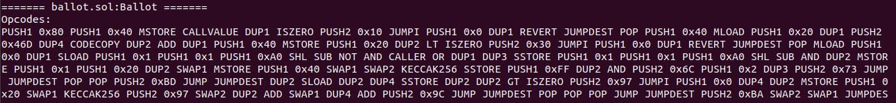
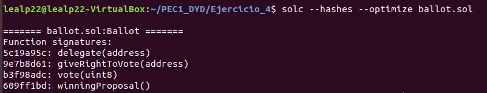
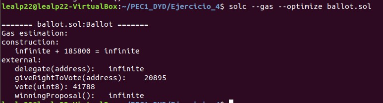

# Ejercicio 4 (2 puntos)
---
Instale el compilador de Solidity (si aún no lo tiene instalado).
Obtenga un contrato inteligente que haya utilizado anteriormente o desarrolle uno tan simple como pueda.
A partir del compilador de Solidity y habilitando siempre la optimización ( --optimize ).

Obtenga:
- Códigos de operación del contrato inteligente.
- Identificadores de las funciones que existan dentro del contrato inteligente.
- Estimación del gas utilizado por cada función.

_Entrega_: Debe entregar el código del contrato inteligente. Puede entregar un documento .md donde se encuentre tanto la instrucción utilizada como la respuesta en consola. Si lo prefiere puede utilizar pantallazos y hacer referencia en ese mismo documento .md.

---
**1º)** Seleccionamos el contrato inteligente codificado en _ballot.sol_.

**2º)** Obtenemos los códigos de operación del contrato utilizando el compilador con los siguientes parámetros:

> _\$ solc --opcodes --optimize ballot.sol > log_paso_2.txt_

En el fichero _log\_paso\_2.txt_ veremos los códigos de forma similar a esto:

> \<Ver imagen Screenshot_1.jpg>  

\<En el fichero log_paso_2.txt se puede ver el contenido completo>

**3º)** Obtenemos los identificadores de las funciones que existen dentro del contrato utilizando el compilador con los siguientes parámetros:

> _\$ solc --hashes --optimize ballot.sol_

> \<Ver imagen Screenshot_2.jpg>  

**4º)** Obtenemos la estimación del gas utilizado por cada función utilizando el compilador con los siguientes parámetros:

> _\$ solc --gas --optimize ballot.sol_

> \<Ver imagen Screenshot_3.jpg>  

