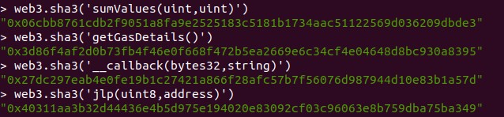
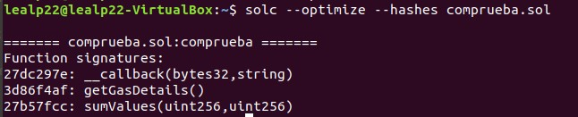
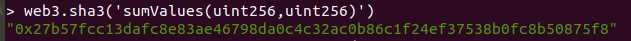

# Ejercicio 5 (2 puntos)

Obtenga sin utilizar el compilador de Solidity el identificador de cada una de las siguientes funciones y justifique cómo los ha obtenido. Muestre mediante un pantallazo la obtención de los identificadores.
- function sumValues (uint _a, uint _b) public view returns (uint _c) {}
- function getGasDetails() public payable{}
- function __callback(bytes32 id, string memory result) public{}
- function abr(uint8 _a, address _address) internal{}
- Debe modificar “abr” por sus iniciales (nombre y apellidos).

*La resolución del ejercicio se debe realizar aplicando un procedimiento manual, es decir, sin utilizar herramientas que obtengan automáticamente los identificadores.

_Entrega_: Debe entregar un documento .md donde se encuentre la justificación y los identificadores obtenidos. Además en el mismo repositorio debe alojar los pantallazos que considere necesarios.

---

**1º)** Según podemos ver en la documentación de Solidity (https://solidity.readthedocs.io/en/latest/abi-spec.html) los primeros cuatro bytes de los datos en un call para la ejecución de una función especifican la función a llamar. Estos son los primeros cuatro bytes del hash Keccak-256 (SHA-3) de la firma de una función, la cual es la expresión canónica del prototipo básico sin especificador de ubicación de datos, es decir, el nombre de la función con la lista entre paréntesis de tipos de parámetros. Los tipos de parámetros se dividen por una sola coma (no se utilizan espacios).

Según esta definción deberíamos obtener el hash Keccak-256 (SHA-3) para las siguientes firmas:
- sumValues(uint,uint)
- getGasDetails()
- __callback(bytes32,string)
- jlp(uint8,address) --> "abr" es reemplazado por las iniciales "jlp"

**2º)** Obtenemos el hash para la firma de las funciones desde la consola de Geth:

> _\> web3.sha3('sumValues(uint,uint)')_  
> "0x*06cbb876*1cdb2f9051a8fa9e2525183c5181b1734aac51122569d036209dbde3"  
> El ID es **06cbb876**

> _\> web3.sha3('getGasDetails()')_  
> "0x*3d86f4af*2d0b73fb4f46e0f668f472b5ea2669e6c34cf4e04648d8bc930a8395"  
> El ID es **3d86f4af**

> _\> web3.sha3('__callback(bytes32,string)')_  
> "0x*27dc297e*ab4e0fe19b1c27421a866f28afc57b7f56076d987944d10e83b1a57d"  
> El ID es **27dc297e**

> _\> web3.sha3('jlp(uint8,address)')_  
> "0x*40311aa3*b32d44436e4b5d975e194020e83092cf03c96063e8b759dba75ba349"  
> El ID es **40311aa3**

> \<Ver imagen Screenshot_1.jpg>  


**3º)** Para confirmar que estos ID son correctos, incluimos las funciones en un contrato hecho en Solidity y los compilamos con la opción:  

> _\$ solc --optimize --hashes comprueba.sol_

```
     pragma solidity ^0.5.7;

     contract comprueba {
        function sumValues(uint _a, uint _b) public view returns (uint _c) {}
        function getGasDetails() public payable {}
        function __callback(bytes32 id, string memory result) public {}
        function jlp(uint8 _a, address _address) internal {}
     }
```
> Y obtenemos el siguiente resultado:  
```
     ======= comprueba.sol:comprueba =======  
     Function signatures:   
     27dc297e: __callback(bytes32,string)  
     3d86f4af: getGasDetails()  
     27b57fcc: sumValues(uint256,uint256)
```  

> \<Ver imagen Screenshot_2.jpg>  


**4º)** Vemos que hay diferencias entre los IDs mostrados tras la compilación y los calculados. Revisando la razón de ello encontramos que: 

- En la documentacion de Solidity (https://solidity.readthedocs.io/en/latest/abi-spec.html#types) encontramos que _uint_ es un alias para _unint256_ y, por tanto, para calcular el identificador de las funciones se debe utilizar _unint256_.
- Una función del tipo _internal_ no tiene identificador. Este tipo de funciones solo pueden utilzarse internamente y no aceptan llamadas con CALL, por lo que no requieren de identificador.

Por tanto, volvemos a calcular el hash de la función _sumValues_:

> _\> web3.sha3('sumValues(uint256,uint256)')_  
> "0x*27b57fcc*13dafc8e83ae46798da0c4c32ac0b86c1f24ef37538b0fc8b50875f8"  
> El ID es **27b57fcc**

> \<Ver imagen Screenshot_3.jpg>  


Con lo que finalmente los identificadores de las funciones serían:

| Firma función             | ID       |  
|---------------------------|----------|  
| sumValues(uint256,uint256)| 27b57fcc |  
| getGasDetails()           | 3d86f4af |  
| _callback(bytes32,string) | 27dc297e |  
| jlp(uint8,address)        | N/A      |  

